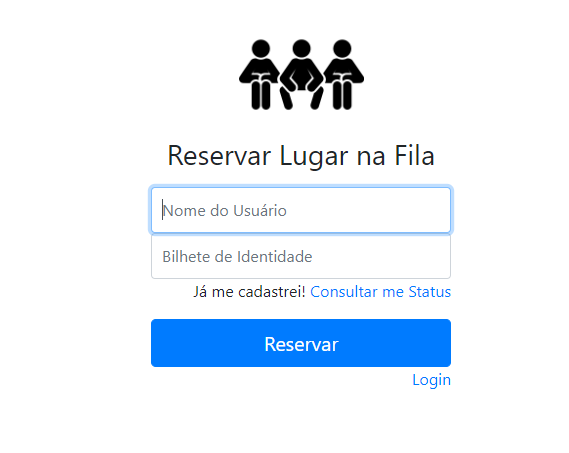
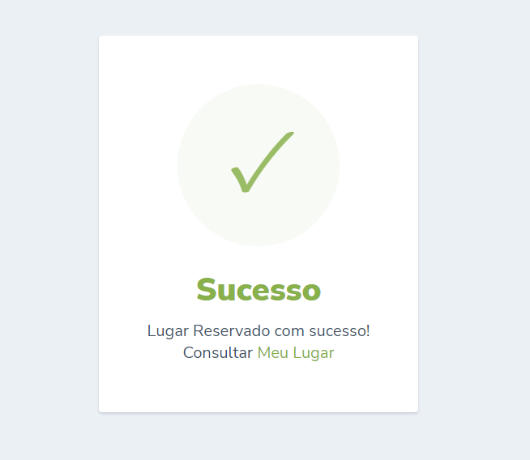
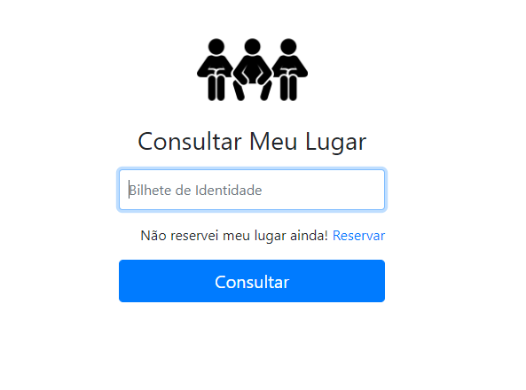
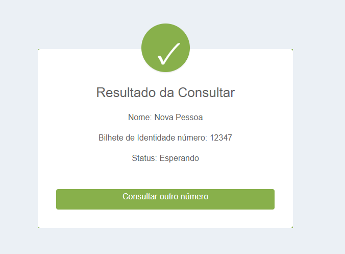
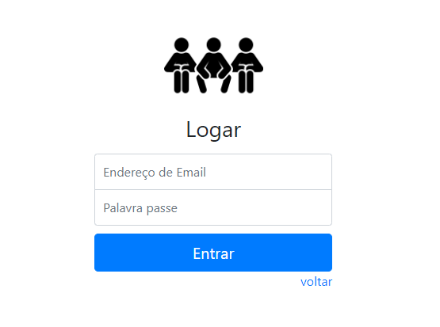
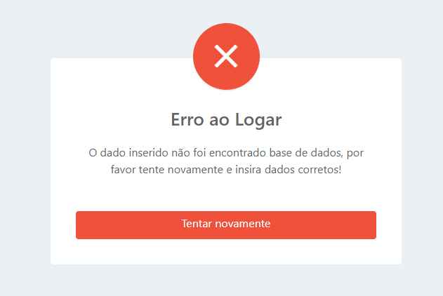
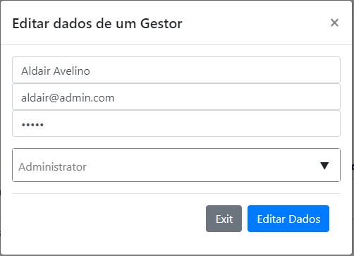
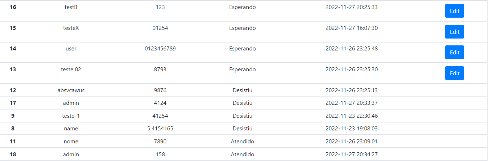
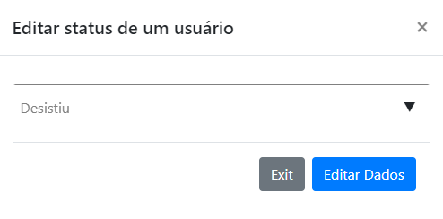

## HOME

## Reservar Lugar

## Feedback sucesso ao reservar

## Consultar Lugar

## Feedback resultado da consulta do lugar

## Login para o Admin ou Moderador

## Feedback de erro ao logar par Admin ou Moderardor

## Lista de todos os Admin e Moderador

## Modal para editar Gestor

## Lista de todos os lugares reservados e com o status

## Modal para editar o status de uma pessoa na fila
