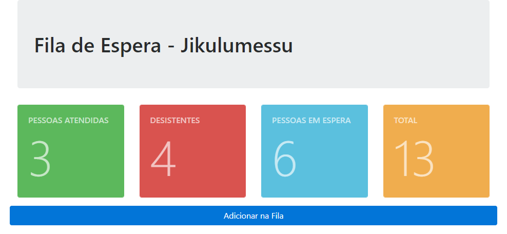

<h1 align="center" style="background: white">
    
</h1>

  <a href="#o-que-é-Jikulumessu">O que é Jikulumessu</a>&nbsp;&nbsp;&nbsp;|&nbsp;&nbsp;&nbsp;
  <a href="#tecnologias">Tecnologias</a>&nbsp;&nbsp;&nbsp;|&nbsp;&nbsp;&nbsp;
  <a href="#layout">Layout</a>&nbsp;&nbsp;&nbsp;|&nbsp;&nbsp;&nbsp;
  <a href="#como-contribuir">Como contribuir</a>&nbsp;&nbsp;&nbsp;|&nbsp;&nbsp;&nbsp;
  <a href="#licença">Licença</a>

 

  

## O que é Jikulumessu

Nota-se uma enorme esorganização no acto de ir até ao banco para poder retirar dinheiro e até mesmo em consultar os valores presentes na conta deste mesmo usuário, fazendo com que assim determinadas pessoas vem para a fila, e depois vão-se embora alegando eles de que retornarão.

Com base ao problema encontrado surgiu a necessidade de usar-se as tecnologias ao favor do Ser Humano, para uma maior resposta a essa falta de organização das filas e possível agendamento apartir de casa para o estabelecimento. Dá então surgiu a ideia do <strong>Jikulumessu</strong>, imagina poder reservar um lugar na fila de um estabelecimento apartir de casa, mas respeitantado também as regras de prioriedades. Imagina poderes ver quais as pessoas estão <trong>esperando</trong>, <strong>foram embora</strong> e quantas pessoas <strong>foram atendidas</strong>.

Esse Sistema de espera será muito minimalista possível, podendo tornar a sua navegação muito amigável, mesmo até para um usuário que seja leigo em termos de navegações. Como também o sistema conta com investigações sobre UX/UI para que assim todos os elementos estejem a empregar a sua devida função e não subsair mais do que outros e sem ter a necessidade de ser muito gritante.

## Tecnologias

Esse projeto foi desenvolvido com as seguintes tecnologias:

- [x] HTML
- [x] CSS
- [x] Bootstrap 4.6.2
- [x] PHP
- [x] MySQL
- [x] MarkDown
- [x] Git & GitHub

## Layout

Você pode visualizar o layout do projeto através [desse link](LAYOUT.md). Lembrando de que as photos são do sistema funcioal. 😎

## Como contribuir

- Faça um fork desse repositório;
- Cria uma branch com a sua feature: `git checkout -b minha-feature`;
- Faça commit das suas alterações: `git commit -m 'feat: Minha nova feature'`;
- Faça push para a sua branch: `git push origin minha-feature`.

- Depois que o merge da sua pull request for feito, você pode deletar a sua branch.

## Licença

Esse projeto está sob a licença MIT. Veja o arquivo [LICENSE](LICENSE.md) para mais detalhes sobre essa mesma licença. 😎

---

<h3 align="center">Feito por [Aldair Avelino](https://github.com/AldairAvelino).</h3>
